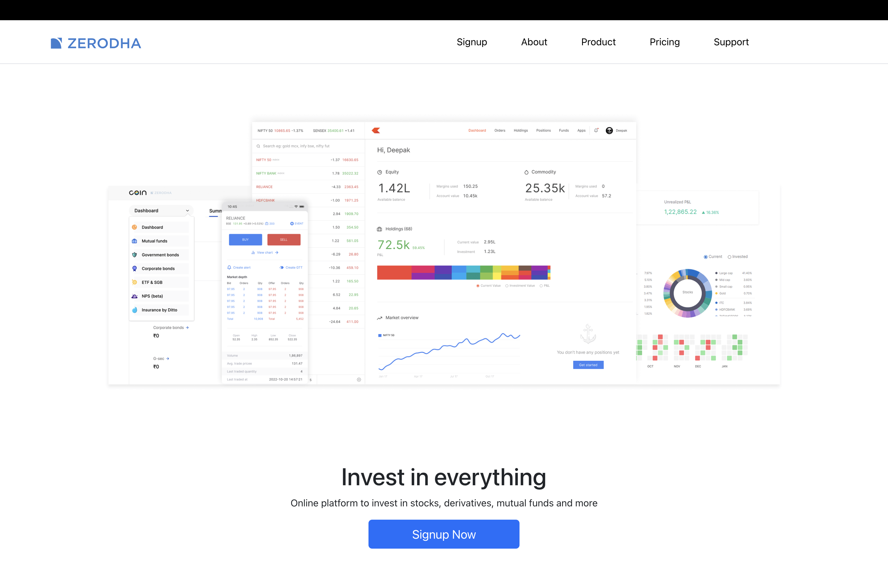

# 📊 TradeVista – Stock Trading Dashboard (Inspired by Zerodha)

TradeVista is a full-stack stock trading dashboard inspired by modern platforms like Zerodha Kite. It allows users to monitor their stock portfolio, track positions, and simulate buy orders through an interactive and responsive interface.

---

## 🎯 Problem Statement

Managing stock portfolios manually can be complex, time-consuming, and error-prone. TradeVista addresses this by providing a centralized dashboard where users can:

* Track holdings and positions
* Visualize portfolio performance
* Simulate trading actions

---

## 📸 Screenshots





---


## 🚀 Live Application

* 🔗 Frontend (Landing Page): https://zerodha-frontend-3qfs.onrender.com
* 🔗 Trading Dashboard: https://zerodha-dashboard-gtnk.onrender.com
* 🔗 Backend API: https://zerodha-backend-wrhv.onrender.com
  
---

## ✨ Key Features

* 📈 Portfolio dashboard displaying stock holdings
* 📊 Track open trading positions
* 🛒 Place buy orders via dashboard
* 🔄 REST API integration between frontend & backend
* 📉 Interactive portfolio visualization
* ⚡ Modular and scalable architecture
* ☁️ Cloud deployment using Render

---

## 🧠 Tech Stack

### Frontend

* React.js
* Material UI
* Axios

### Backend

* Node.js
* Express.js

### Database

* MongoDB Atlas

### Deployment

* Render Cloud Platform

---

## 🏗️ System Architecture

The application follows a client-server architecture:

User → React UI → Axios → Express API → MongoDB → Response → UI

* Frontend communicates with backend via REST APIs
* Backend processes requests and interacts with MongoDB
* Data is dynamically rendered using reusable React components

---

## 🔌 API Endpoints

| Method | Endpoint      | Description              |
| ------ | ------------- | ------------------------ |
| GET    | /allHoldings  | Fetch all stock holdings |
| GET    | /allPositions | Fetch open positions     |
| POST   | /newOrder     | Create a new buy order   |

---

## 🧪 Testing & QA Approach

* Performed manual testing of all major user flows
* Validated API endpoints using Thunder Client
* Tested edge cases:

  * Invalid order inputs
  * Empty portfolio states
  * API failure scenarios
* Verified UI consistency and responsiveness

---

## ⚠️ Challenges & Solutions

* Handling asynchronous API calls → Managed using Axios and proper state updates
* Managing complex UI state → Optimized using reusable React components
* Debugging API errors → Used Thunder Client for endpoint testing
* Ensuring data consistency → Implemented backend validation

---

## 📂 Project Structure

```
TradeVista/
│
├── frontend/        # Landing Page (React)
├── dashboard/       # Trading Dashboard (React)
├── backend/         # Express API + MongoDB
└── README.md
```

---

## ⚙️ Installation & Setup

### 1️⃣ Clone the Repository

```bash
git clone https://github.com/ayushhhkumar/tradevista-trading-dashboard.git
cd tradevista-trading-dashboard
```

---

### 2️⃣ Setup Backend

```bash
cd backend
npm install
```

Create `.env` file inside backend folder:

```
MONGO_URL=your_mongodb_connection_string
PORT=3002
```

Run backend:

```bash
node index.js
```

---

### 3️⃣ Setup Dashboard

```bash
cd dashboard
npm install
npm start
```

---

### 4️⃣ Setup Frontend

```bash
cd frontend
npm install
npm start
```

---

## 🚀 Deployment

The application is deployed using Render:

* Backend → Render Web Service
* Dashboard → Render Static Site
* Frontend → Render Static Site
* Database → MongoDB Atlas

---

## 📚 Key Learnings

* Built scalable full-stack application using MERN
* Gained hands-on experience with REST API design
* Improved debugging and testing practices
* Learned cloud deployment and environment setup

---

## 🔮 Future Improvements

* 🔐 User authentication (Login / Signup)
* 📡 Real-time stock market API integration
* 📊 Advanced analytics dashboard
* 📱 Mobile responsiveness improvements
* ⚡ WebSocket-based live updates

---

## 👨‍💻 Author

**Ayush Kumar**
🔗 GitHub: https://github.com/ayushhhkumar

---

## 📜 License

This project is created for educational and portfolio purposes.
