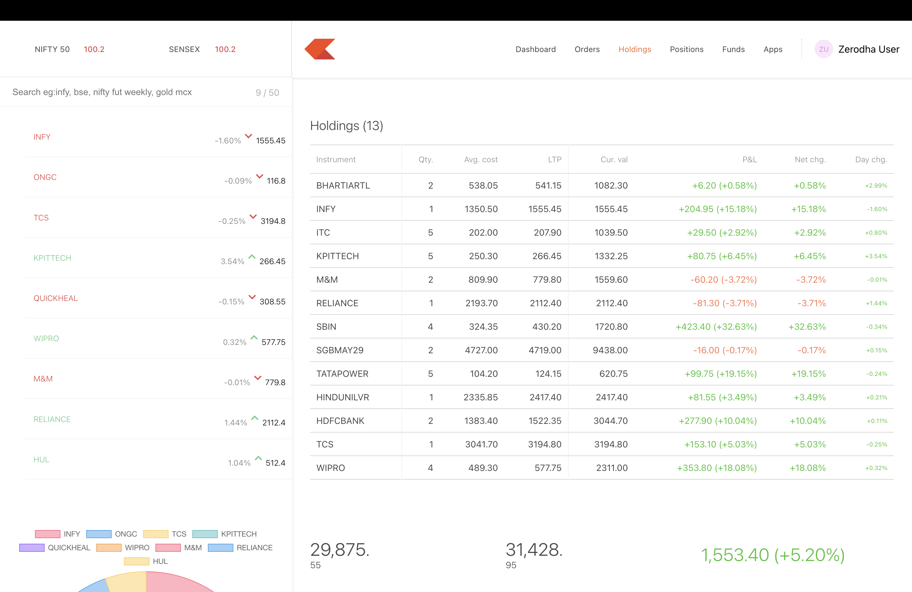

# TradeVista – Stock Trading Dashboard

TradeVista is a **full-stack stock trading dashboard inspired by modern trading platforms such as Zerodha Kite**.
The application allows users to monitor their stock portfolio, track positions, and place buy orders through an interactive dashboard interface.

This project demonstrates **full-stack MERN development, REST API integration, database management, and cloud deployment**.

---

# Live Application

Frontend (Landing Page)
https://zerodha-frontend-3qfs.onrender.com

Trading Dashboard
https://zerodha-dashboard-gtnk.onrender.com

Backend API
https://zerodha-backend-wrhv.onrender.com

---

# Tech Stack

### Frontend

* React.js
* Material UI
* Axios

### Backend

* Node.js
* Express.js

### Database

* MongoDB Atlas

### Deployment

* Render Cloud Platform

---

# Key Features

* Portfolio dashboard displaying stock holdings
* View and track open trading positions
* Place buy orders through the dashboard
* REST API integration between frontend and backend
* Interactive portfolio visualization with charts
* Clean and modular project architecture
* Cloud deployment with MongoDB Atlas database

---

# Project Architecture

```id="5d5uk9"
TradeVista
│
├── frontend
│   └── React landing page
│
├── dashboard
│   └── React trading dashboard
│
├── backend
│   └── Express.js API connected to MongoDB
│
└── README.md
```

---

# API Endpoints

| Method | Endpoint      | Description              |
| ------ | ------------- | ------------------------ |
| GET    | /allHoldings  | Fetch all stock holdings |
| GET    | /allPositions | Fetch open positions     |
| POST   | /newOrder     | Create a new buy order   |

---

# Installation (Run Locally)

### 1 Clone the Repository

```bash id="az3v07"
git clone https://github.com/ayushhhkumar/tradevista-trading-dashboard.git
cd tradevista-trading-dashboard
```

---

### 2 Setup Backend

```bash id="2vijow"
cd backend
npm install
```

Create a `.env` file inside the backend folder:

```id="nsz43h"
MONGO_URL=your_mongodb_connection_string
PORT=3002
```

Run the backend server:

```bash id="6wr0ns"
node index.js
```

---

### 3 Setup Dashboard

```bash id="xwwe6y"
cd dashboard
npm install
npm start
```

---

### 4 Setup Frontend

```bash id="5crh5p"
cd frontend
npm install
npm start
```

---

# Screenshots

You can include screenshots of:

* Trading Dashboard
* Holdings Page
* Buy Order Window
* Portfolio Charts

Example:

```id="6a8x8g"

```

---

# Deployment

The application is deployed using **Render**.

Services used:

* Backend → Render Web Service
* Dashboard → Render Static Site
* Frontend → Render Static Site
* Database → MongoDB Atlas Cloud Database

---

# Future Improvements

* User authentication (Login / Signup)
* Real-time stock market API integration
* Portfolio analytics dashboard
* Mobile responsive improvements
* WebSocket-based live market updates

---

# Author

Ayush Kumar

GitHub
https://github.com/ayushhhkumar

---

# License

This project is developed for **learning, educational, and portfolio purposes**.
